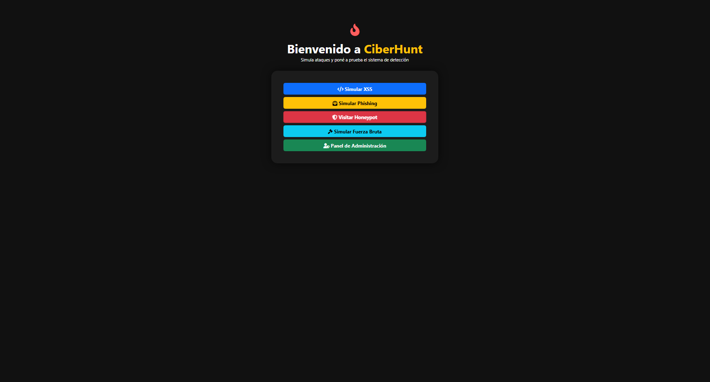
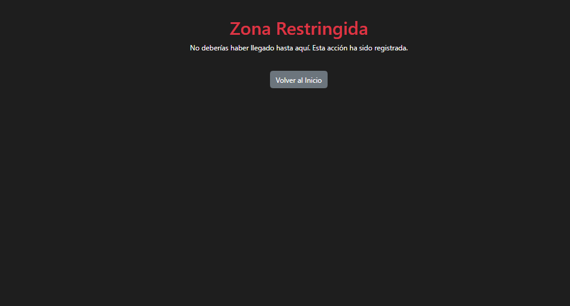
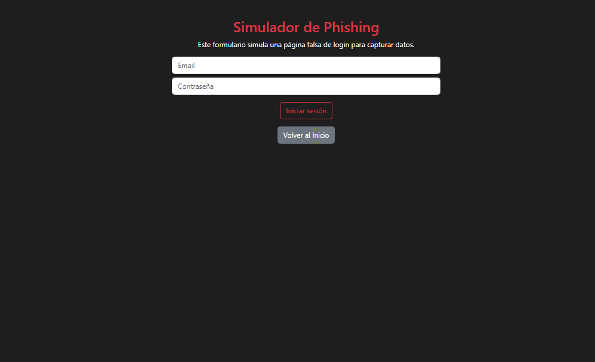

# 🚨 CiberHunt v1.2 — Web IDS & Honeypot Simulator

**CiberHunt** is a web-based Intrusion Detection System (IDS) simulation platform built with Flask. It allows you to simulate and detect common attacks, track attacker behavior, and manage IP blocking — ideal for learning cybersecurity fundamentals.

---

## 🎯 What does it do?

- Detects simulated attacks:
  - **XSS**
  - **Phishing**
  - **Brute-force login**
  - **Honeypot (trap routes)**

- Automatically blocks suspicious IPs.
- Simulates fake attacks using random IPs.
- Includes an admin dashboard to review all events.

---

## 🛠 Technologies Used

- **Python 3** + Flask
- **SQLite** for lightweight storage
- **Bootstrap 5** for UI design
- **Chart.js** for attack visualizations
- **Werkzeug Security** (hashed login)
- **Native Logging** for audit trails

---

## 🚀 Key Features (v1.2)

✅ Attack detection with type + severity classification  
✅ Auto-blocking system for repeated attacker IPs  
✅ Admin panel with visual dashboard (charts, metrics)  
✅ Manual IP unblock feature  
✅ Export attack data to CSV  
✅ REST API at `/api/attacks`  
✅ Simulate random fake attacks via `/demo`  
✅ Secure admin login (`admin123`)  
✅ Log viewer (`/logs`)  
✅ Localhost is never blocked (safe dev environment)

---

## 📸 Screenshots

<table>
  <tr>
    <td align="center"><b>Home</b><br></td>
    <td align="center"><b>Dashboard</b><br></td>
    <td align="center"><b>Honeypot</b><br></td>
  </tr>
  <tr>
    <td align="center"><b>Brute Force Login</b><br></td>
    <td align="center"><b>XSS Detection</b><br></td>
    <td align="center"><b>Phishing Simulation</b><br></td>
  </tr>
</table>


---

## 👤 Default Admin User

```plaintext
Username: admin
Password: admin123
```

> You can change this in `app.py` under the `if __name__ == '__main__'` block.

---

## 📂 Installation

```bash
git clone https://github.com/33Tobias/Ciberhunt
cd Ciberhunt
pip install -r requirements.txt
python app.py
```

---

## 📌 Useful Routes

| URL | Description |
|-----|-------------|
| `/` | Home |
| `/xss` | Simulate XSS |
| `/phishing` | Simulate phishing form |
| `/fuerza_bruta` | Simulate brute-force login |
| `/honeypot` | Trap endpoint |
| `/admin` | Admin login |
| `/dashboard` | Metrics and blocked IPs |
| `/unblock/<ip>` | Unblock an IP |
| `/logs` | View system log |
| `/demo` | Trigger fake attack from random IP |
| `/api/attacks` | JSON API with full attack list |

---

## 📘 Notes

- **Not for production** use — this is an educational tool.
- Designed for ethical hacking demos, training, and self-study.
- Can be extended with real honeypots or network hooks.

---

## 👨‍💻 Author

Built by [@33Tobias](https://github.com/33Tobias) — Version 1.2  
Licensed under MIT


