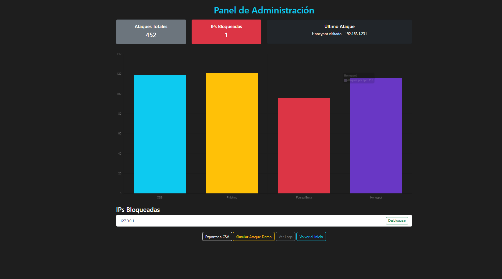
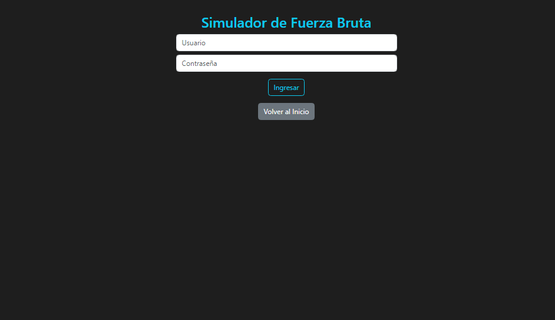

# 🚨 CiberHunt v1 - Basic IDS & Honeypot Web App

CiberHunt is a web application built with Flask to simulate common cyber attacks such as:

- XSS  
- Brute Force  
- Phishing  
- Honeypot (hidden traps)

The system detects these attempts and logs them in an attack ranking, which can be exported to CSV for further analysis.  
Additionally, it includes an automatic IP blocking mechanism for suspicious behavior.

---

## 🎯 Project Goals

- Simulate real attack scenarios for learning purposes.
- Apply basic detection techniques.
- Provide an educational environment for cybersecurity training.
- Record attack patterns and classify attackers.

---

## 🛠 Technologies Used

- **Python 3**
- **Flask**
- **SQLite** (attack logging)
- **Bootstrap 5** (web interface)
- **Logging** (blocked IPs log)

---

## 📸 Screenshots

<table> 
<tr> 
<td align="center"><b>Home</b></td> 
<td align="center"><b>Ranking</b></td> 
</tr> 
<tr> 
<td></td> 
<td></td> 
</tr> 
<tr> 
<td align="center"><b>Brute Force</b></td> 
<td align="center"><b>Honeypot</b></td> 
</tr> 
<tr> 
<td></td> 
<td></td> 
</tr> 
</table>

---

## 🚀 Installation and Usage

```bash
git clone https://github.com/33Tobias/Ciberhunt
cd CiberHunt
pip install -r requirements.txt
python app.py
