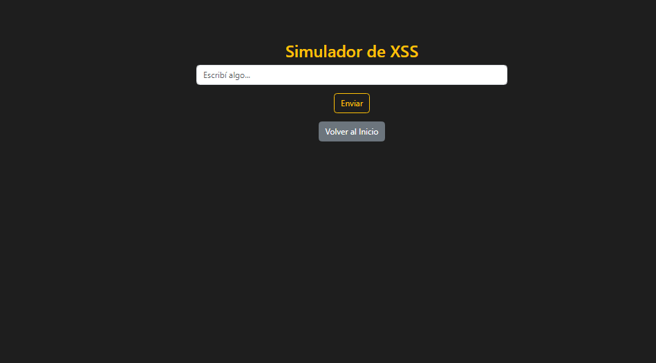
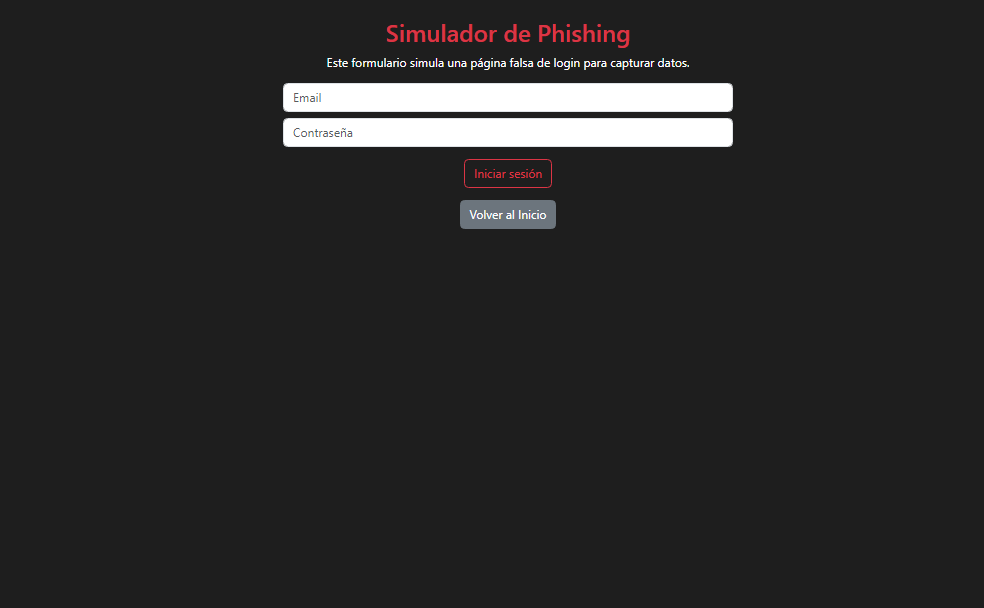

# 🚨 CiberHunt v1.2 — Web IDS & Honeypot Simulator

**CiberHunt** is a lightweight yet powerful **web-based Intrusion Detection System simulator** built with Flask. It helps you understand the fundamentals of cybersecurity by simulating, detecting, and visualizing common web attacks — all through an interactive dashboard.

---

## 🎯 Core Capabilities

- 🔍 Real-time detection of:
  - **Cross-Site Scripting (XSS)**
  - **Phishing Attempts**
  - **Brute-Force Logins**
  - **Honeypot Entrapment Routes**

- 🔒 Automatic IP blocking for persistent threats
- 🧠 Simulated attack generator with randomized IPs
- 📊 Admin dashboard with charts, metrics, and logs

---

## 🛠 Built With

- **Python 3** + [Flask](https://flask.palletsprojects.com/)
- **SQLite** — fast, embedded DB
- **Bootstrap 5** — clean responsive UI
- **Chart.js** — interactive visualizations
- **Werkzeug Security** — password hashing
- **Python logging** — attack log trails

---

## 🚀 What's New in v1.2

| Feature | Status |
|--------|--------|
| Attack Classification (Risk + Type) | ✅ |
| Persistent IP Blocking | ✅ |
| Fake Attack Simulator | ✅ |
| CSV Export | ✅ |
| Admin Log Viewer | ✅ |
| Secure Login | ✅ |
| REST API `/api/attacks` | ✅ |
| Auto-ignore localhost IP | ✅ |

---

## 📸 UI Screenshots

<table>
  <tr>
    <td align="center"><b>Home</b><br></td>
    <td align="center"><b>Dashboard</b><br></td>
    <td align="center"><b>Honeypot</b><br></td>
  </tr>
  <tr>
    <td align="center"><b>Brute Force</b><br></td>
    <td align="center"><b>XSS</b><br></td>
    <td align="center"><b>Phishing</b><br></td>
  </tr>
</table>

---

## 👤 Admin Login (Default)

```plaintext
Username: admin
Password: admin123
```

> You can change these credentials in the `app.py` under the `__main__` block.

---

## 📦 Setup Instructions

```bash
git clone https://github.com/33Tobias/CiberHunt
cd Ciberhunt
pip install -r requirements.txt
python app.py
```

Then open `http://127.0.0.1:5000` in your browser.

---

## 🌐 Routes Overview

| Route | Description |
|-------|-------------|
| `/` | Main homepage |
| `/xss` | XSS test field |
| `/phishing` | Fake phishing form |
| `/fuerza_bruta` | Brute-force login form |
| `/honeypot` | Fake restricted route |
| `/admin` | Admin login |
| `/dashboard` | Attack dashboard + logs |
| `/logs` | Real-time log view |
| `/unblock/<ip>` | Remove IP from blocklist |
| `/demo` | Trigger random simulated attack |
| `/api/attacks` | JSON API with attack records |

---

## 📌 Developer Notes

- 💡 This tool is meant for **educational** purposes only.
- ⚠️ Not suitable for production environments.
- 🧪 Ideal for workshops, cybersecurity learning, and ethical hacking practice.

---

## 👨‍💻 Author

Developed by [@33Tobias](https://github.com/33Tobias)  
Version **1.2** — MIT License

> Feel free to fork, star, or contribute!

